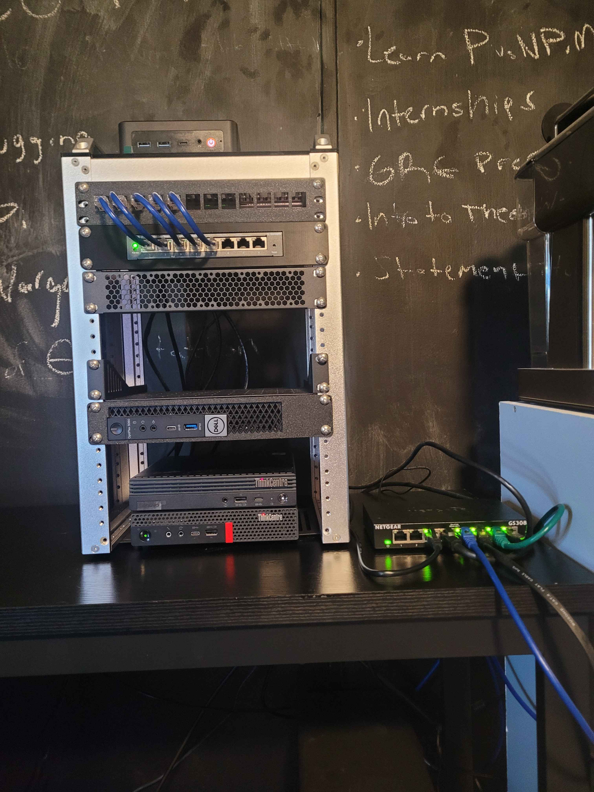
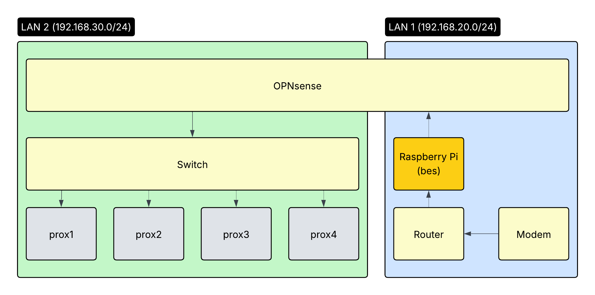

# Hardware Overview

My homelab is built using mostly spare networking and computing devices that have been gifted to me. Most of the hardware is a smaller form factor, so I decided that a ten inch rack would be sufficient for my needs. All the ethernet was terminated and crimped myself for the lab.

The goal was to create a low-cost and modular environment that would allow me to experiment with networking and security operations. The past version of the lab used enterprise equipment, which was nice for exposure, but turned my room into a blast furnace. Once the datacenter is complete, it would be possible to access the machines away from home and hack at vulnerable boxes and build my own security operations center.

## Rack Setup

- Rack Size: 10-inch rack (8U)
- Layout:
    - Above the rack: OPNsense Firewall
    - 1U: Patch Panel
    - 1U: Switch
    - 3U: Rack Screen (TBD)
    - 1U: Proxmox Node (prox3)
    - 1U: Proxmox Node (prox2)
    - 1U: Proxmox Node (prox1)
    - Below the rack: Proxmox Node (prox4)

## Networking

Since this lab may eventually host malware and run some dangerous scripts, it was important to me to include measures to properly segment and sandbox the machines. The included switch (TP-Link TL-SG108PE) is VLAN-aware, and can help segment when necessary.

I did not want the lab to sit on the main LAN, but I also want to host services that are web routable (e-book server, portfolio site, CS capstone). To solve this, I use a Raspberry Pi (bes) as a reverse proxy into my lab environment, where I can restrict access and terminate SSL at the edge, keeping my backend services isolated from the internet.

The lab sits behind an OPNsense firewall, which handles routing, DHCP, and traffic filtering for the lab, the 192.168.30.0/24 subnet. The firewall rules prevent lab devices from communicating with the main LAN (192.168.20.0/24), while still allowing outbound internet access and inbound connections from bes for reverse proxying.

## Compute

My Proxmox cluster, Ennead, consists of three currently active nodes, with a fourth (prox3) reserved for when I can afford a working drive.

| Node | Device | CPU | RAM | Storage |
|------|--------|-----|-----|---------|
| prox1 | Lenovo `11A5S23A00` | AMD Ryzen 5 PRO 3400GE | 13GB | 477GB WD Black SN730 NVMe |
| prox2 | Lenovo `11DQS12R02` | Intel Core i5-10500T | 15GB | 477GB Samsung NVMe |
| prox4 | Lenovo `30BFS0E200` | Intel Xeon W-2125 @ 4.0GHz | 30GB | 477GB Samsung NVMe |
| prox3 | Dell Optiplex 5060 | TBD | TBD | TBD (pending drive) |

This is more than enough compute for my needs. I will be able to host containers inside of Proxmox to run various services as well as have ample backup for storing and running various VMs.