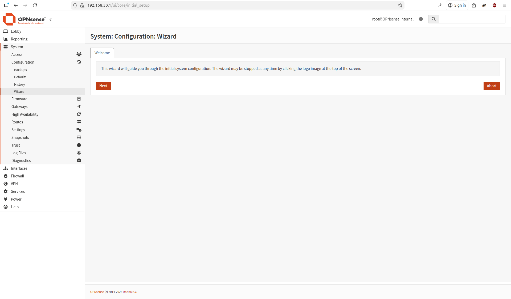

# OPNsense Setup

## Flashing
Boot from the OPNsense install drive. Let all the login scripts run without interrupting. Eventually, you will be prompted for a credential, use `installer/opnsense`. If your disk is greater than 8 gigs (it probably is), choose ZFS as your file system. If you are not running a RAID config and only have one disk, choose stripe. Otherwise, if you have two drives, mirror. If you have more drives, then you are more qualified to select your RAID selections. Use the arrow keys to select the drive you are flashing to and let it work!

Once you have flashed, before rebooting, change your root password. Then go ahead and remove the install media. The box will now be flashed with the OPNsense OS. Moving forward, we need to configure the network interfaces via CLI before we can access the web GUI.

## Interface Assignment
Login to your OPNsense console with user `root` and the password you created. On the CLI, select the option to assign interfaces (was 1 for me). You will be given a list of physical interfaces. At this point, you should have both of your ethernet cables connected through your two ports on the box. The issue is that they may not be labelled! And because of this, you may need to do some swapping around if you miss out on the WAN/LAN 50/50. If your WAN interface receives an IP address from your upstream DHCP server, then you guessed correct! If not, redo the prompt and reverse your assignments.

## LAN Configuration
Now we need to configure our LAN interface. You will be prompted if you wish to receive a DHCP. We will deny this, as the firewall will be the default gateway for the LAN, and therefore, must be a static IP. It will, however, be the DHCP server for the LAN. I assigned the LAN interface as `192.168.30.1/24`. It is best practice to have some sort of system for your IP assignments. Something like this:
- x.1 - x.10 should be network related devices, firewall, switches etc.
- x.50 - x.100 should be static IPs for services, etc.
- x.100 - x.200 could be a range for DHCP

Of course, this isn't the only way to design your networks. It is not very address space efficient, but for a small lab like this, we do not need custom subnet masks and complex layouts. We can spare the addresses.

We can now verify that the configuration works by attaching a device to the LAN side. My setup has the LAN from OPNsense running into a switch, where the rest of the LAN can connect. From a Linux device, you can run:

```
sudo dhcpcd
```

You should get an IP address in the .30.X range, whatever your DHCP range was. You can check your IP addresses with `ip addr'.

Go ahead and check your connectivity. You can try:

`ping 192.168.30.1` - The OPNsense box. You need this to work before moving on.
`ping 8.8.8.8` - Pinging a DNS server. Shows basic internet connection.
`ping 192.168.20.1` - Whatever IP your upstream router is. We will block this eventually for security.

And if it works, then we can continue configuration in the web GUI! It can be found in a browser on your LAN at `http://192.168.30.1`.

## Web GUI Setup



*NOTE:* If you are configuring a homelab like me, where the WAN is just another LAN and not necessarily internet-facing, there are a few settings that will need to be toggled.