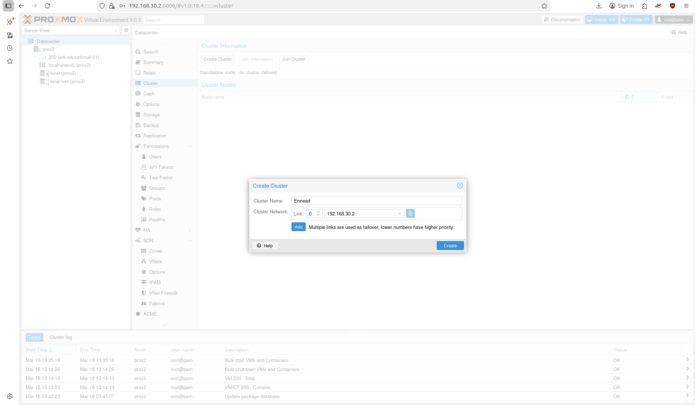

# Proxmox Cluster

## Cluster Setup
A proxmox cluster is a group of bare metal computers each running Proxmox. Clustering them allows for a centralized location to manage the compute on each. From before my lab migration, I already had Proxmox configured on one of my minis. This mini, `prox1`, was used as the foundation of the cluster. For each system, though, you will need to flash it with Proxmox VE. Find the download, plugin your boot USB, change boot sequence in BIOS, and get flashing!

In the first Proxmox node, we will create the cluster. Navigate to Datacenter -> Cluster -> Create Cluster, and name it. I chose Ennead.



Now, after the cluster has been created, we can start linking the Proxmoxes together. It is a tad easier knowing the FQDN and IP addresses we set. These should 100% be static IP addresses on the Proxbox machines.

| Node | FQDN | IP |
|------|------|----|
| prox1 | prox1.local | 192.168.30.2 |
| prox2 | prox2.local | 192.168.30.102 |
| prox4 | prox4.local | 192.168.30.103 |

Now, from each Proxmox machine that is not part of the cluster, we need to run:

```
pvecm add <ip-of-cluster>
```

This being prox1 for me. We will be prompted for credentials, then linked together!